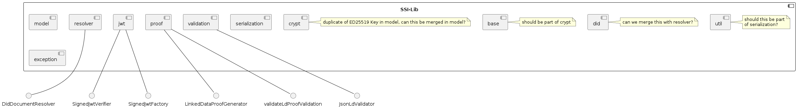

# Architecture

**Documentation Template: arc42**

arc42, the template for documentation of software and system
architecture.

Template Version 8.2 EN. (based upon AsciiDoc version), January 2023

Created, maintained and © by Dr. Peter Hruschka, Dr. Gernot Starke and
contributors. See <https://arc42.org>.

## Introduction and Goals

The *SSI Agent Lib* (in the following referred to as **lib**) provides functions and concepts commonly required when implementing an digital wallet or other service that makes use of self-sovereign identites (SSI).

### Requirements Overview

The lib shall include features to support the following use cases and interactions:

| Feature                                    | Constraints                     | Details / Link                          |
|--------------------------------------------|---------------------------------|-----------------------------------------|
| Create DID                                 |                                 | [link](FeatureSpec-CreateDid.md)        |
| Parse DID                                  |                                 | [link](FeatureSpec-ParseDid.md)         |
| Generate DID document                      |                                 | [link](FeatureSpec-GenerateDidDoc.md)   |
| Resolve DID document                       |                                 | [link](FeatureSpec-ResolveDidDoc.md)    |
| Create Verifiable Credential               | Limited to pre-defined schemas. | TBD                                     |
| Create Proof for Verifiable Credential     |                                 | [link](FeatureSpec-CreateSignedVC.md)   |
| Create Verifiable Presentation             |                                 | TBD                                     |
| Verify Verifiable Presentation             |                                 | TBD                                     |
| Validate Verifiable Presentation           |                                 | TBD                                     |
| Generate a key pair                        | Only Ed25519 supported.         | [link](FeatureSpec-GenerateKeyPair.md)  |

### Quality Goals

| Priority | Quality Goal  | Scenario                                                                            |
|----------|-------------- |-------------------------------------------------------------------------------------|
| 1        | Flexibility   | Multiple cryptographic algorithms have to be supported.                             |
| 1        | Extensibility | Custom implementations can be integrated for certain aspects. (e.g. DID resolution) |
| 2        | Usability     | The lib can be used and integrated easily in other systems.                         |

## Architecture Constraints

- Java has to be used as the programming language. Both EDC and MIW are based on Java and the same tech-stack makes integration easier.
- [JWT](https://www.w3.org/TR/vc-data-model/#json-web-token) based verifiable presentations have to be used in order to be as interoperable with the [DAPS](https://github.com/International-Data-Spaces-Association/IDS-G/tree/main/Components/IdentityProvider/DAPS) as possible. DAPS uses JWT Access-Tokens for AuthN/AuthZ.
- [JsonWebKeys2020](https://www.w3.org/community/reports/credentials/CG-FINAL-lds-jws2020-20220721/) used as Crypto Suite for VCs & VPs

## System Scope and Context

- The SSI Lib is intended to be used by the Catena-X Managed Identity Wallet (MIW), Eclipse Dataspace Connector (EDC) or third party self-hosted wallets.
- The SSI Lib provides DID resolution capabilities for did:web, but is designed in a way that allows external DID resolution to be used as well (i.e. Uniresolver).

## Solution Strategy

- No state management
- No data persistency
- Segregated Interfaces to allow usage of internal features and external components alike. Internal and external DID resolution is interchangeable (e.g. DidDocumentResolver.java)

## Building Block View

### Whitebox Overall System

**Overview**

As it can be seen above, the library is cut into various packaged based on the provided SSI features. In addition packages like model, exception provide basic necessities.

**Contained Building Blocks**
- resolver
- jwt
- model
- proof
- serialization
- util
- validation
- exception
- did
- base
- crypt

**Important Interfaces**  
- DidDocumentResolver
- LinkedDataProofGenerator
- validateLdProofValidator
- SignedJwtVerifier
- SignedJwtFactory
- JsonLdValidator

## Runtime View
The runtime behaviour can be found in the respective Feature Specs.

## Deployment View
The SSI Lib can be integrated into an application as a standard JAR file (i.e. via Maven/Gradle/etc.). 
Hence no additional deployment artifacts are neccessary for it.

## Cross-cutting Concepts

### *\<Concept 1>*

*\<explanation>*

## Architecture Decisions

## Quality Requirements

- The library can create a JWT based proof via JsonWebKey2020 / ED25519 signature within 0.5 seconds on current generation server hardware under normal load (< 50% CPU Utilization)

## Risks and Technical Debts
- Support only ED25519
- No proper interface for Key encoding, just byte array for now

## Glossary

| Term | Definition                         |
|------|------------------------------------|
| EDC  | Eclipse Dataspace Connector        |
| MIW  | Managed Identity Wallet            |
| SSI  | Self-Sovereign Identity            |
