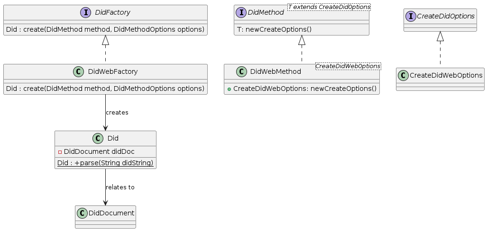

# Feature: Create DID

## 1. Specification

Create a Decentralized Identifier (DID) as specified in [W3C-DID-Core](https://www.w3.org/TR/did-core/), for a set of supported DID methods.

*Example:*
```
did:web:mydomain.com:12345
```

#### 1.1 Assumptions
There is no need to ensure uniqueness of the created DID.

#### 1.2 Constraints
Currently only DID method **did:web** *MUST* be supported.

#### 1.3 System Environment
Any kind of registration process of a DID is out of scope and needs to be handled by the client.

## 2. Architecture

#### 2.1 Overview
*Provide here a descriptive overview of the software/system/application architecture.*

#### 2.2 Component Diagrams
*Provide here the diagram and a detailed description of its most valuable parts. There may be multiple diagrams. Include a description for each diagram. Subsections can be used to list components and their descriptions.*

#### 2.3 Class Diagrams


* DidFactory - Public factory interface.
* DidMethod - Defines a DID method, and allows retrieving a **CreateDidOptions** object specific to the respective DID method.
* CreateDidOptions - Marker interface. Implementations hold properties required to create a new DID of the respective **DidMethod**.
* DidFactoryRegistry - *MAY* be used to register **DidFactory** implementations for multiple **DidMethod**s
* DidWebMethod - Example implementation of **DidMethod** for method *did:web*.
* CreateDidWebOptions - Example implementation of **CreateDidOptions** for method *did:web*.
* Did - Value class representing a DID. *MAY* refer to a **DidDocument**
* DidDocument - Value class representing a DID document.

#### 2.4 Sequence Diagrams
*Provide here any sequence diagrams. If possible list the use case they contribute to or solve. Provide descriptions if possible.*
